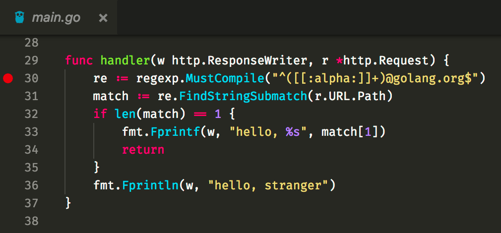

# Debugging Go programs with delve

For quite a long time people asked for a good debugger for Go.
GDB works, but it doesn't really understand Go routines and that causes complications
when debugging Go programs as soon as they start to get a bit complicated.

Luckily, the Go community provided a new debugger called
[delve](https://github.com/derekparker/delve). If you haven't installed it yet,
please follow [these
instructions](https://github.com/derekparker/delve/tree/master/Documentation/installation)
before continuing.

We will debug the web server implemented in [this directory](../webserver).
It's a very simple web server that checks the path of the HTTP request and it
prints `hello, foo` if the path was something like `localhost:8080/foo@itu.dk`,
and `hello, stranger` otherwise.

Try it now. It might not work ... and that's ok. Do not fix it just yet!

## Debugging the webserver

To start the `webserver` program simply visit the directory with your terminal
and run:

```
$ dlv debug
Type 'help' for list of commands.
(dlv)
```

This command will compile the current package and generate a binary that can be
debugged correctly.

If you try to visit http://localhost:8080 you will see that the server is not
running. This is normal, since our binary was loaded but not executed yet!
Let's make it run by typing `continue` (or shorthand `c`).

```
$ dlv debug
Type 'help' for list of commands.
(dlv) continue
```

Try visiting http://localhost:8080 again and you should be able to try the webserver.
Visit now http://localhost:8080/student@itu.dk, it should show `hello, student`.
Does that work?

It's time to debug! Let's stop the execution by typing `ctrl+c` on the delve console.
This will stop the execution at some point, we do not really care exactly where.

We can now set a breakpoint so whenever the function `handler` is executed we can see
what is going on. Then we continue with the execution.

```
(dlv) break main.handler
Breakpoint 1 set at 0x1226d88 for main.handler() ./main.go:29
(dlv) continue
```

Alternatively, you can also set a breakpoint by specifying the filename with
the line number and use `b` for shorthand, e.g. this is equivalent to above:

```
(dlv) break main.go:29
Breakpoint 1 set at 0x1226d88 for main.handler() ./main.go:29
(dlv) continue
```

If now you visit http://localhost:8080/student@itu.dk the debugger will stop
the execution and show you where it stopped.

```
(dlv) continue
> main.handler() ./main.go:29 (hits goroutine(6):1 total:1) (PC: 0x1226d88)
    24: func main() {
    25:         http.HandleFunc("/", handler)
    26:         log.Fatal(http.ListenAndServe("localhost:8080", nil))
    27: }
    28:
=>  29: func handler(w http.ResponseWriter, r *http.Request) {
    30:         re := regexp.MustCompile("^([[:alpha:]]+)@itu.dk$")
    31:         match := re.FindStringSubmatch(r.URL.Path)
    32:         if len(match) == 1 {
    33:                 fmt.Fprintf(w, "hello, %s", match[1])
    34:                 return
```

Great, it's on line 29 right at the beginning of the `handler` function. Now
you can use `locals` to show the variables available at that point of the
program. You can print single variables using the `print` (`p`) command
together with the variable name.

1. Try printing the `http.Request`. What it tells you?

You can go step by step in the execution by running `next` `n`.

### Exercise: debugging with the delve console

1. Using `next` and `print` try to figure out why `FindStringSubmatch` is
   returning an empty match.

   
2. There's still one more issue, try to figure out why
   http://localhost:8080/student@itu.dk still prints `hello, stranger` instead
   of `hello, student` by setting up breakpoints and investigating the values
   of the variables in the scope.

## Using delve from inside your editor

### vim/neovim

Follow the instructions to install
[vim-delve](https://github.com/sebdah/vim-delve).

On Mac OS, you need to set `let g:delve_backend = "native"`
in your `vimrc` file.
If you are using vim, you also need to install:

- Shougo/vimshell.vim
- Shougo/vimproc.vim

You can then set breakpoints with `DlvAddBreakpoint` and start debugginf by
running `DlvDebug` from within your vim session.

### VSCode

Using delve from the console seems quite useful, but VSCode offers a great
integration too. Let's see how that works.

First open [webserver/main.go](../webserver/main.go) on VSCode.

You can set up breakpoints by clicking left from a line number.



To start running the process you need to first open the debug panel by clicking
on the <image src="debug.png" height=20px> symbol, or `command+D`. Then press
the green play (▶) button and if requested select Go from the list of
languages.

Your server is now running, and if you visit http://localhost:8080/student@itu.dk
you will see how VSCode shows the program reached the breakpoint we set.


Now you can hover over any of the variables to show their value! And for more
complicated expressions you can also use the debug console at the bottom of the
editor. Type `r.URL.Path` in there, and you'll see its value.

Alternatively, you can also modify your user settings to set
`"debug.inlineValues"` to `true`, so you'll be able to see inline the values of
the variables as you assign them.

To control the execution you can now use the debug menu displayed below instead
of typing `next`, `continue`, etc.


## Further References

- [Delve Commands](https://github.com/derekparker/delve/tree/master/Documentation/cli)


## Congratulations

You're a master of delve! Seriously, there's not much more to learn about
debuggers and this will help you figure out why your code behave mysteriously.

Let's stop debugging and learn how to test with the [next
chapter](../2-testing/1-go-test.md).
