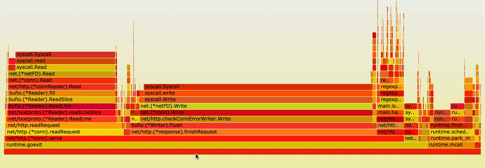

# Flame Graphs

Flame Graphs are a different way of displaying information obtained by profiling
software. It has the advantage that it shows code paths in a more natural way
allowing programmers to understand how to optimize their programs eaiser.

You can read more about them in [this page](http://www.brendangregg.com/flamegraphs.html), by the creator of the flame graph.

Rather than spending a long time explaining why they're better, let's simply use
them! In order to generate flame graphs from Go we will use
[go-torch](https://github.com/uber/go-torch) tool developed by Uber.

In order to install it, simply run:

```
$ go get github.com/uber/go-torch
```

You also need to install the FlameGraph scripts and add them to your path:
```
cd $GOPATH/src/github.com/uber/go-torch
git clone https://github.com/brendangregg/FlameGraph.git
export PATH=$PATH:$GOPATH/src/github.com/uber/go-torch/FlameGraph
```

Then while running the server and some traffic into it with `go-wrk`, we can
run the following command.

```bash
$ go-torch -t 5
INFO[23:10:47] Run pprof command: go tool pprof -raw -seconds 5 http://localhost:8080/debug/pprof/profile
INFO[23:10:52] Writing svg to torch.svg
```

Now, let's see what we have in that `torch.svg` file! It's an interactive SVG graph,
we can click around and navigate to better understand what took the longest for
each function.

The longest time we spent in a function, the wider the function will appear on the
graph. The colors and the order on the graph are random, so do not pay attention to
those.



According to this it seems like we spend most of our time compiling the regular
expression ... over an over.

## Generating flame graphs from existing cpu profiles

Flame graphs are awesome, so I understand that you might want to use them with
the result of running a benchmark with `-cpuprofile`. It's also very simple,
simply run:

```bash
$ go-torch --binaryname binary.test -b pprof.cpu
INFO[23:10:47] Run pprof command: go tool pprof -raw binary.test pprof.cpu
INFO[23:10:52] Writing svg to torch.svg
```

Then simply open the SVG file as before.

### Exercise: putting everything together

Now that we understand how to write benchmarks, create performance profiles
from running servers, and how to display that information with amazing flame
graphs it is time to put all of our knowledge together and optimize our
web server.

How can you make it faster?

Do a small modification at a time, and make sure to either use benchmarks or
profile the running server to decide what's the next step. Then use `go-wrk`
to have a new idea of the external performance of the server.

Document everything, because that's the only way you will be able to explain
why your server is now *magically* twice as fast!

## Congratulations

You're now a master of performance! You're able to get any program and analyze
it with benchmarks and pprof, generate graphs that provide a clear view of what
the program is spending time on, and choose the best optimization.

That's awesome, but there's more! Let's see how you can have even a better view
of what a Go program does with the [Go execution tracer](../4-tracing/1-tracing.md).
